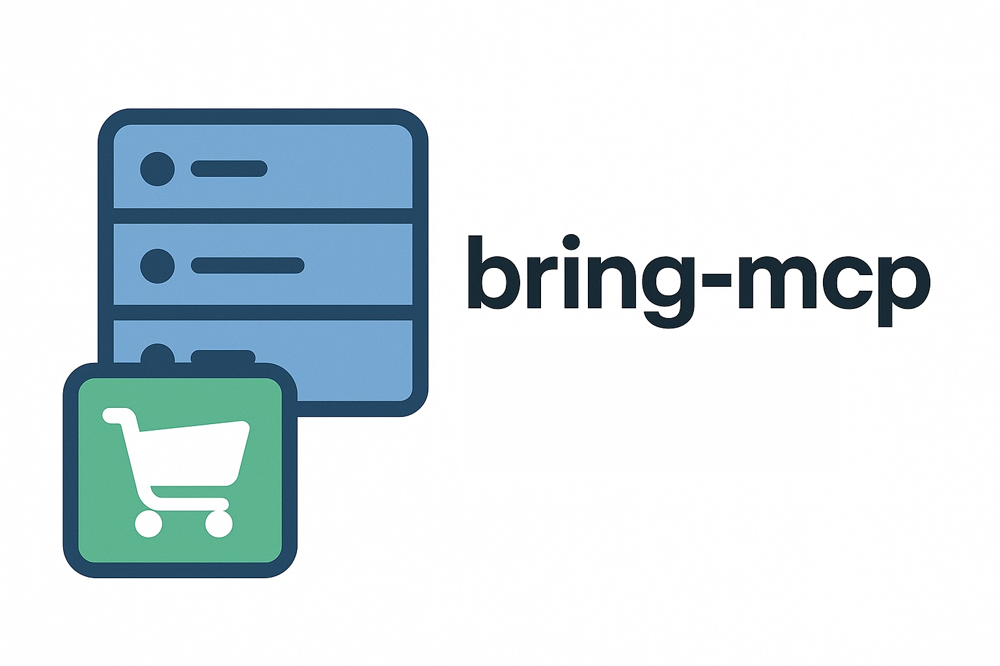

# MCP Server for Bring! Shopping



This project implements a local Model Context Protocol (MCP) server in TypeScript that exposes the functionalities of the Bring! shopping list API. It enables applications like Claude Desktop to interact with your Bring! shopping lists using standardized MCP tools.

The server integrates the `bring-shopping` npm package for Bring! API access and leverages `@modelcontextprotocol/sdk` to provide an MCP-compliant server interface.

> **Disclaimer:**  
> This is a personal project. I am not affiliated with Bring! Labs AG in any way.  
> This project uses an **unofficial Bring! API**, which may change or be blocked at any time. 
> This could cause the MCP server to stop functioning without prior notice.

---

## 🚀 Features

- Exposes Bring! API functions as MCP tools:
  - 🔐 Login
  - 🧾 Load shopping lists
  - 🛒 Get and modify items (add, remove, move)
  - 🖼 Save/remove item images
  - 👥 Manage list users
  - 🌐 Load translations & catalog
  - 📨 Retrieve pending invitations
- Communicates via STDIO (for use with Claude Desktop or MCP Inspector)
- Supports Bring! credentials via `.env` file or injected environment variables

---

## ⚙️ Setup and Installation

1. **Clone the repo (or obtain the files)**

2. **Navigate into the project directory:**

   ```bash
   cd path/to/bring-mcp
   ```

3. **Install dependencies:**

   ```bash
   npm install
   ```

4. **Create `.env` file (if not injecting ENV directly):**

   ```env
   MAIL=your_email@example.com
   PW=your_password
   ```

5. **Build the project:**

   ```bash
   npm run build
   ```

6. **Make script executable (optional on Unix):**
   ```bash
   chmod +x build/index.js
   ```

---

## 🏃 Running the Server

Launch the MCP server with:

```bash
node build/index.js
```

If successful, you'll see: `MCP server for Bring! API is running on STDIO` (on `stderr`).

---

## 🧪 Testing with MCP Inspector

1. Ensure `npm run build` has been executed.
2. Ensure `.env` with valid credentials exists.
3. Run Inspector:
   ```bash
   npx @modelcontextprotocol/inspector node /ABS/PATH/bring-mcp/build/index.js
   ```

---

## 🧩 Claude Desktop Integration

1. **Locate config:**

   - macOS: `$HOME/Library/Application Support/Claude/claude_desktop_config.json`

2. **Update config:**

   ```json
   {
     "mcpServers": {
       "mcp-bring": {
         "command": "node",
         "args": ["/ABSOLUTE/PATH/TO/bring-mcp/build/index.js"],
         "env": {
           "MAIL": "your_bring_email@example.com",
           "PW": "YOUR_BRING_PASSWORD_HERE"
         }
       }
     }
   }
   ```

3. **Restart Claude Desktop.**

---

## ✅ Final Notes

- 🔒 Avoid committing your `.env` file.
- 🧼 Keep credentials out of version control.
- 🛠 MCP Inspector is invaluable for debugging.

Happy coding with MCP and Bring! 🎉
